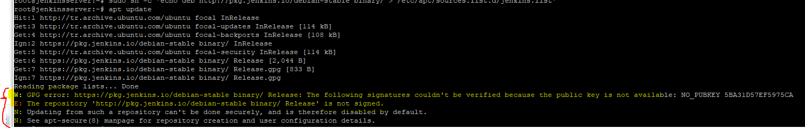

# Install GitBash
```
https://git-scm.com/download/win
```

# Jenkins
```

sudo apt update
sudo apt upgrade
sudo apt install openjdk-11-jdk
wget -q -O - https://pkg.jenkins.io/debian/jenkins.io.key | sudo apt-key add -
sudo sh -c 'echo deb http://pkg.jenkins.io/debian-stable binary/ > /etc/apt/sources.list.d/jenkins.list'
sudo apt update

```
# if you take error following when process update:


Run command following, please:

```
sudo apt-key adv --keyserver keyserver.ubuntu.com --recv-keys 5BA31D57EF5975CA

sudo apt update
sudo apt install <package-name>
```
Continue install jenkins

```
sudo apt install jenkins
sudo systemctl start jenkins
sudo systemctl enable jenkins

```
# Step 6: Access Jenkins Web Interface
Jenkins web interface runs on port 8080 by default. Open a web browser and navigate to http://<your_server_ip>:8080. You will be prompted to enter the initial admin password, which you can find on your Ubuntu machine by running the following command:

```
sudo cat /var/lib/jenkins/secrets/initialAdminPassword
```

## Jenkins Plugins
* CloudBees Docker Build and Publish

* SonarQube Scanner


# Docker Install
```
sudo apt-get update
sudo apt-get upgrade

curl https://releases.rancher.com/install-docker/19.03.sh | sh
```

```
Jenkins user'ın docker grubuna eklenmesi
sudo usermod -aG docker jenkins
```

# Kubectl Install
```
curl -s https://packages.cloud.google.com/apt/doc/apt-key.gpg | sudo apt-key add -
sudo touch /etc/apt/sources.list.d/kubernetes.list 
echo "deb http://apt.kubernetes.io/ kubernetes-xenial main" | sudo tee -a /etc/apt/sources.list.d/kubernetes.list
sudo apt-get update
sudo apt-get install -y kubectl
sudo reboot
```

# Choco Install
```
Set-ExecutionPolicy Bypass -Scope Process -Force; `
  iex ((New-Object System.Net.WebClient).DownloadString('https://chocolatey.org/install.ps1'))
```

# Minikube

```
Powershell yönetici olarak çalıştırılır.
choco install minikube

minikube start --cpus 4 --driver=virtualbox

Minikube hata verirse.
bcdedit /set hypervisorlaunchtype off
```

# Jenkins User
```
Jenkins User Home: /var/lib/jenkins
su jenkins
cd
mkdir .kube
cd .kube
vi config
Copy  configfile
[ESC] :wq!

Test için;
kubeclt get nodes

NAME       STATUS   ROLES                  AGE   VERSION
minikube   Ready    control-plane,master   20d   v1.20.2

```

# Kubernetes
```
kubectl create namespace dev
kubectl create namespace test
kubectl create namespace prod
```


# SonarQube Start
```
mkdir $HOME/sonarqube-test
docker run -d -v $(pwd)/sonarqube-test:/root/src --name sonarqube -p 9000:9000 -p 9092:9092 sonarqube


Java version hatası verirse
sudo apt-get install openjdk-11-jdk
```


## Others
* Delete docker images
```
docker images -a | grep "days" | awk '{print $3}' | xargs docker rmi -f
```
* https://lingojam.com/TexttoOneLine
* ip route add 192.168.99.0/24 dev enp0s3
  
  Open the command line
  Set your username:
  git config --global user.name "nergis.aktug"
  Set your email address:
  git config --global user.email "nergis.aktug2020@gmail.com"
  test arçelik son proje
